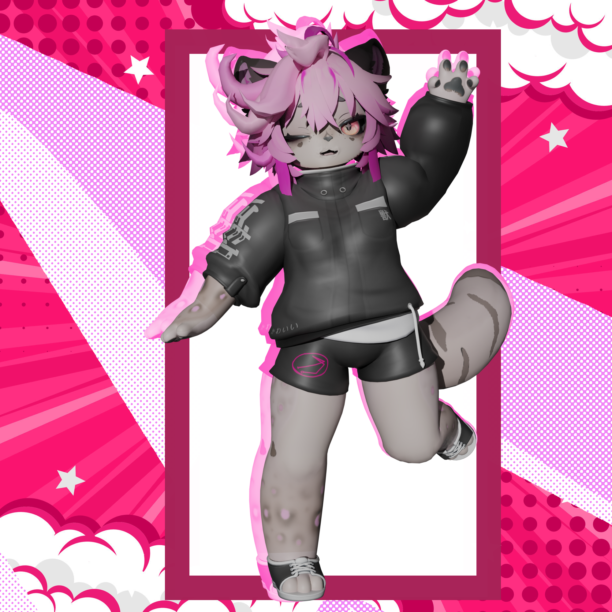

<h1 align="center">Welcome!, I'm Juan Esteban Aristizábal Ortiz</h1>
<h3 align="center">Digital Entertainment Design Engineer, passionate about 3d modelling and videogames",</h3>

I am studying my last semester of Digital Entertainment Design Engineering with emphasis on game development, VR/AR, 3D/2D and game design.

# About Me!
## 3d Modelling (Blender, substance, photoshop)
Click to go to my Art Station

## Noctanbus VR (Beware of flashy game effects)

Escape Room in VR, tested with Oculus Quest 2.

## Tower Defense (Blunt Defender)

## Unity Stuff

Shaders 

Click here to see some of my last shaders

